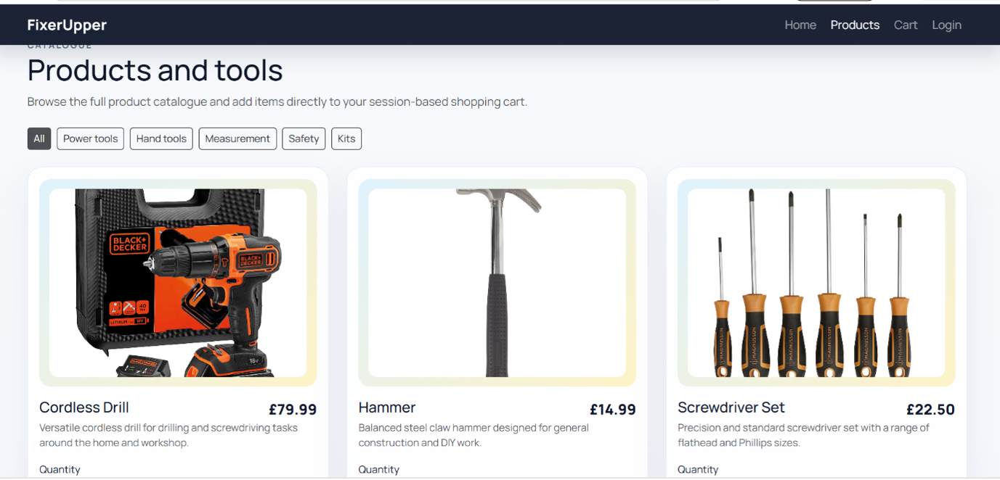
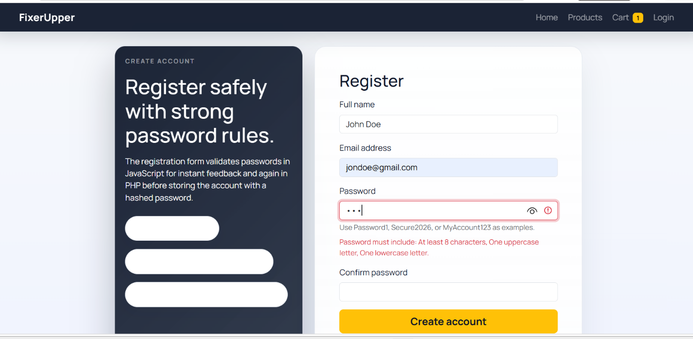
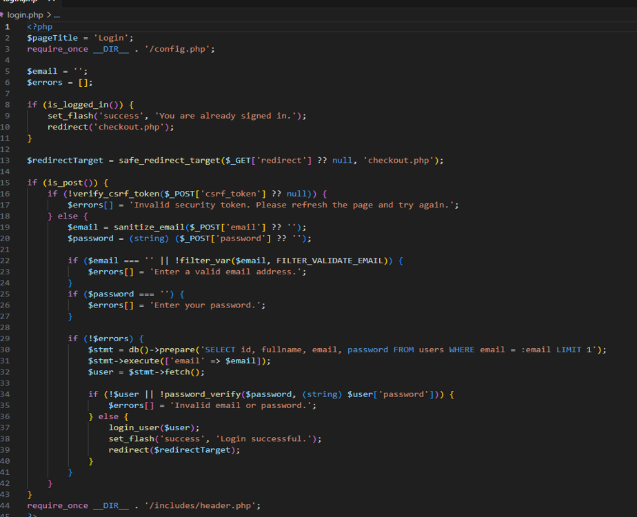
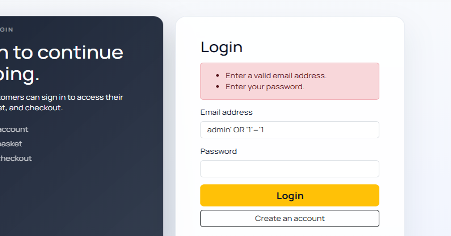
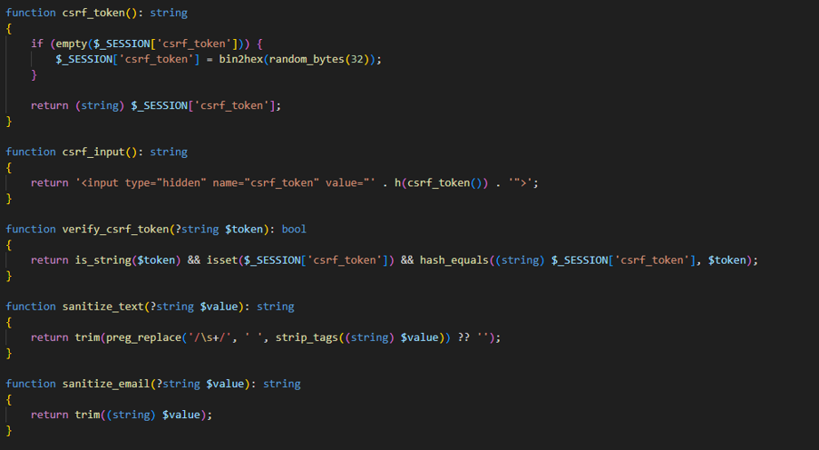

# 🔐 FixerUpper — Secure Web Application

A security-focused web application built with **PHP and MySQL** to demonstrate practical implementation of secure software development principles and protection against common web application vulnerabilities.

FixerUpper uses a functional e-commerce environment to demonstrate how security controls can be integrated throughout an application's authentication, session management, form handling and database access layers.

The project implements defences against **SQL Injection, Cross-Site Scripting (XSS), Cross-Site Request Forgery (CSRF), insecure password storage, session fixation and session hijacking**.

---

## 🛡️ Security Overview

Security is a core part of the application architecture rather than an additional layer added after development.

The application implements:

- 🔑 Secure password hashing and verification
- 💉 SQL Injection protection using PDO prepared statements
- 🧼 XSS mitigation through output escaping and input handling
- 🛡️ CSRF token generation and server-side validation
- 🍪 HttpOnly and SameSite session cookies
- 🔄 Session ID regeneration after authentication
- ⏱️ Automatic session timeout after inactivity
- ✅ Server-side input validation
- 🔒 Secure authentication and logout handling

---

## 💻 Application Preview

The security controls are implemented within a functional e-commerce application containing product browsing, authentication, shopping cart functionality, checkout and order processing.



---

# 🔐 Security Implementation

## 1. SQL Injection Protection

Database access is performed using **PDO prepared statements**, separating SQL commands from user-supplied data.

Authentication attempts containing SQL injection payloads are treated as ordinary input rather than executable SQL.

Example test:

```text
admin' OR '1'='1
```

The application rejects the malicious input rather than allowing authentication bypass.



### Implementation

```php
$stmt = db()->prepare(
    'SELECT id, fullname, email, password
     FROM users
     WHERE email = :email
     LIMIT 1'
);

$stmt->execute(['email' => $email]);
$user = $stmt->fetch();
```

Using parameterised queries prevents user-controlled values from modifying the structure of the SQL statement.

---

## 2. Secure Authentication

The authentication flow combines:

- Email validation
- Server-side input validation
- CSRF verification
- PDO prepared statements
- Password hash verification
- Secure session creation

Passwords are verified using PHP's `password_verify()` rather than comparing or storing plaintext credentials.



Authentication flow:

```text
Login Request
     │
     ▼
CSRF Validation
     │
     ▼
Input Validation
     │
     ▼
PDO Prepared Query
     │
     ▼
User Lookup
     │
     ▼
Password Verification
     │
     ▼
Session ID Regeneration
     │
     ▼
Authenticated Session
```

---

## 3. Strong Password Validation

Account registration applies password requirements before an account can be created.

Validation is performed in the browser for immediate feedback and enforced again by the PHP backend.



Passwords are stored using secure password hashing rather than plaintext storage.

This reduces the impact of credential exposure if database contents are compromised.

---

## 4. CSRF Protection

State-changing forms are protected using **Cross-Site Request Forgery tokens**.

The application generates a cryptographically random token:

```php
function csrf_token(): string
{
    if (empty($_SESSION['csrf_token'])) {
        $_SESSION['csrf_token'] = bin2hex(random_bytes(32));
    }

    return (string) $_SESSION['csrf_token'];
}
```

The token is inserted into forms as a hidden value and validated when requests reach the server.

```php
function verify_csrf_token(?string $token): bool
{
    return is_string($token)
        && isset($_SESSION['csrf_token'])
        && hash_equals(
            (string) $_SESSION['csrf_token'],
            $token
        );
}
```



This helps prevent malicious websites from submitting authenticated requests on behalf of a logged-in user.

---

## 5. Cross-Site Scripting (XSS) Protection

User-controlled values are escaped before being rendered into HTML.

The application uses a helper function for safe output:

```php
function h(?string $value): string
{
    return htmlspecialchars(
        (string) $value,
        ENT_QUOTES | ENT_SUBSTITUTE,
        'UTF-8'
    );
}
```

This reduces the risk of malicious input being interpreted as executable browser content.

---

## 6. Secure Session Management

PHP sessions are configured with additional security controls:

```php
ini_set('session.use_strict_mode', '1');
ini_set('session.use_only_cookies', '1');
ini_set('session.cookie_httponly', '1');
ini_set('session.cookie_samesite', 'Lax');
```

When HTTPS is available, the application can also enable the `Secure` cookie attribute.

After successful authentication:

```php
session_regenerate_id(true);
```

Regenerating the session identifier helps protect against **session fixation attacks**.

The application also tracks user activity and expires inactive sessions after **30 minutes**.

---

## 7. Session Timeout

Inactive authenticated sessions are automatically terminated.

The application informs the user when their session has expired and requires authentication again.

This limits the amount of time an abandoned authenticated browser session remains usable.

---

# 🏗️ Security Architecture

```text
                         USER
                           │
                           ▼
                 ┌─────────────────┐
                 │  Browser / UI   │
                 └────────┬────────┘
                          │
                    HTTP Request
                          │
                          ▼
              ┌──────────────────────┐
              │   Input Validation   │
              │   CSRF Validation    │
              │   XSS Protection     │
              └──────────┬───────────┘
                         │
                         ▼
              ┌──────────────────────┐
              │    Authentication    │
              │   Session Security   │
              │ Password Verification│
              └──────────┬───────────┘
                         │
                         ▼
              ┌──────────────────────┐
              │    PHP Backend       │
              │                      │
              │ Products             │
              │ Accounts             │
              │ Cart                 │
              │ Checkout             │
              │ Orders               │
              └──────────┬───────────┘
                         │
                  PDO Prepared
                    Statements
                         │
                         ▼
              ┌──────────────────────┐
              │        MySQL         │
              │                      │
              │ Users                │
              │ Products             │
              │ Orders               │
              │ Order Items          │
              └──────────────────────┘
```

---

# 🛒 Application Functionality

The e-commerce functionality provides a realistic environment in which the security controls are applied.

### Product Catalogue

Users can browse available products and product categories.

### Shopping Cart

Products can be added, removed and updated using a session-based shopping cart.

### User Accounts

Customers can register and authenticate before accessing protected functionality.

### Checkout

Authenticated customers can enter delivery information, review their order and submit it for processing.

### Order Processing

Completed orders and their associated items are stored in the relational database.

---

# 🛠️ Technology Stack

| Technology | Purpose |
|---|---|
| **PHP** | Backend logic and security controls |
| **MySQL** | Relational data persistence |
| **PDO** | Parameterised database access |
| **HTML5** | Application structure |
| **CSS3** | Styling |
| **Bootstrap 5** | Responsive interface |
| **JavaScript** | Client-side interaction and validation |
| **Apache** | Web server |
| **XAMPP** | Local development environment |

---

# 📂 Project Structure

```text
FixerUpper/
│
├── index.php
├── products.php
├── register.php
├── login.php
├── logout.php
├── account.php
├── cart.php
├── checkout.php
├── confirm_order.php
│
├── config.php
├── database.sql
├── .env.example
├── .gitignore
├── README.md
│
├── includes/
│   ├── header.php
│   └── footer.php
│
└── screenshots/
    ├── products.png
    ├── password-validation.png
    ├── sql-injection-protection.png
    ├── secure-authentication.png
    └── csrf-protection.png
```

---

# 🗄️ Database

The relational database stores:

```text
users
products
orders
order_items
```

Relationships between orders and order items allow individual products belonging to each customer order to be recorded separately.

Database operations involving user-controlled data are executed using PDO prepared statements.

---

# ⚙️ Configuration

Database configuration can be supplied through environment variables:

```env
DB_HOST=127.0.0.1
DB_PORT=3307
DB_NAME=fixerupper_db
DB_USER=root
DB_PASS=
```

An `.env.example` file documents the required configuration.

Real credentials should never be committed to source control.

---

# 🚀 Running Locally

### 1. Clone the repository

```bash
git clone https://github.com/vasile007/FixerUpper-Secure-Web-Application.git
```

### 2. Configure the environment

Configure the database connection using the values documented in:

```text
.env.example
```

### 3. Create the database

Create:

```sql
CREATE DATABASE fixerupper_db;
```

Then import the supplied database schema.

### 4. Start the application

Run Apache and MySQL through XAMPP and open the application through the local Apache server.

---

# 🧪 Security Testing

The application was tested against security-related scenarios including:

| Security Area | Test |
|---|---|
| SQL Injection | Authentication bypass payload rejected |
| Authentication | Invalid credentials rejected |
| Password Security | Password requirements enforced |
| Password Storage | Passwords stored as hashes |
| CSRF | Forms protected using security tokens |
| XSS | User-controlled output escaped |
| Sessions | Session ID regenerated after authentication |
| Session Lifetime | Inactive sessions expire automatically |
| Cookies | HttpOnly and SameSite protections configured |

---

# 🎯 What This Project Demonstrates

This project demonstrates practical experience with:

- **Secure Software Development**
- **OWASP-style web application security controls**
- PHP backend development
- Authentication and authorisation concepts
- Password security
- SQL Injection prevention
- Cross-Site Scripting mitigation
- Cross-Site Request Forgery protection
- Secure session management
- Relational database design
- Server-side validation
- Security testing
- Full-stack web development

The project demonstrates how security controls can be incorporated throughout the **software development lifecycle**, rather than treated as a separate feature after application development.

---

# 🔮 Future Security Improvements

Potential improvements include:

- Multi-factor authentication (MFA)
- Role-Based Access Control (RBAC)
- Login rate limiting
- Account lockout policies
- Email verification
- Password recovery
- Security audit logging
- Content Security Policy (CSP)
- Automated SAST/DAST security testing
- HTTPS production deployment
- Dockerised deployment
- CI/CD security scanning

---

# 👤 Author

**Vasile Bejan**

GitHub: **vasile007**

---

## ⚠️ Disclaimer

FixerUpper is a security-focused prototype designed to demonstrate secure web application development practices.

It is not intended to process real financial transactions or store production customer data.
